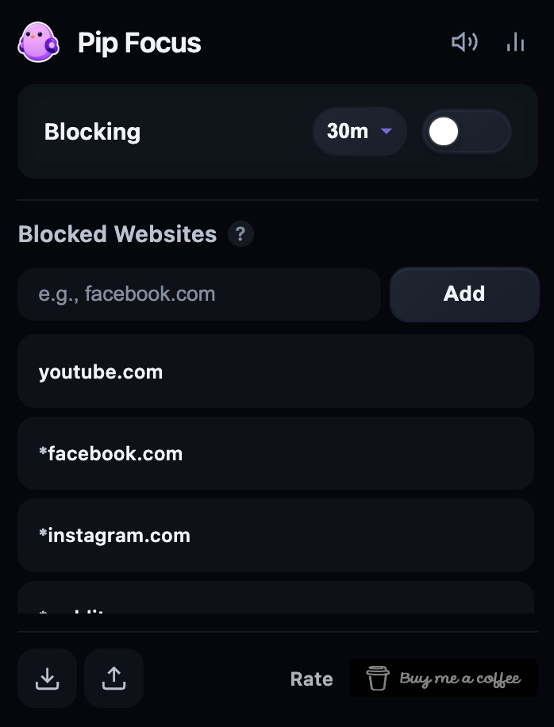
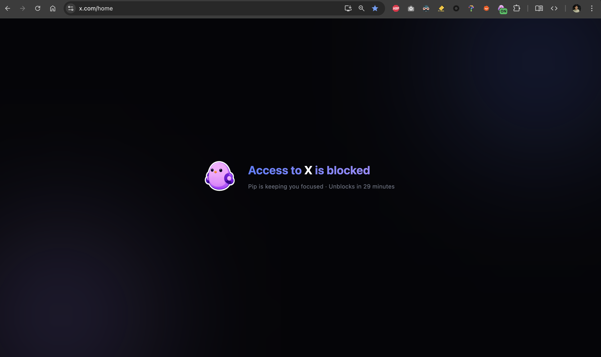
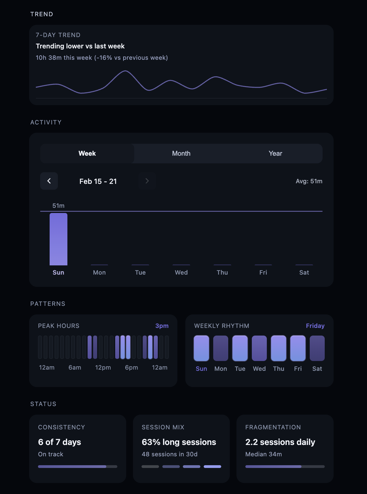

# I Built a Chrome Extension Because My Brain keeps Procrastinating

We all know the feeling: there's work to do, but the brain just won't stay on one thing.

One second I'm working, and the next I find myself on Twitter "monitoring the situation" or watching YouTube.

It was frustrating. I had plenty of energy, just not enough discipline to aim it in the right direction.

So I stopped expecting willpower to save me and built a small Chrome extension instead. It's called Pip Focus.

It does one simple thing: when you turn it on, it blocks the websites you waste time on. You set a timer, and those sites stop loading.

One simple thing, done well. That's it.

I kept the design minimal because productivity tools can be distracting too. This one stays quiet and gets out of the way.

Things I cared about:

- Clean, simple design - one click to start
- Hard to turn off by accident
- Stats to track progress and build better habits
- No ads, no tracking, no subscriptions

I started building it for myself, but it turned out pretty great, so I figured someone else might find it useful too.

Give it a try & lemme know how it goes!

Happy working 🙂

---

[Website](https://arpitjp.github.io/focus-mode-chrome-extension/) · [Get Pip Focus on Chrome Web Store](https://chromewebstore.google.com/detail/focus-mode/ijgbeipckbajgnkjgdhoponeenjdnimn)
